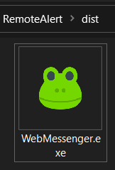

# Live WebMessenger for prompters
This app is builded and tested only on Windows.

## How to use it

1 - Download this Github Repository. 
2 - Connect your PC to a network (wifi or ethernet).
3 - To launch the App open the .exe file in: dist > WebMessenger.exe

The program has two windows: prompt and the massage window.

Connect the second device (i.e. Smartphone) to the same network. Open the socket ( = IP address + port) on the browser.

to be finished...  

